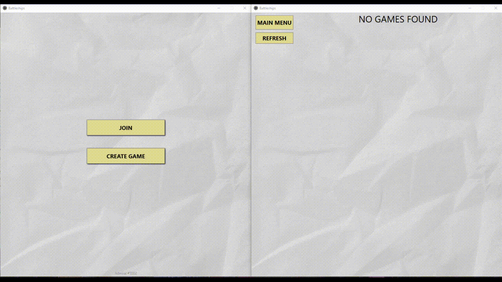

# Battleships

Client for my multiplayer Battleships game, made using WPF and WebSockets

I had planned to do a small project to learn C#, but it has grown to a size that I did not expect.

[Version 1.0 with client and server executables](https://github.com/Awluple/Battleships/releases/tag/1.0)



## File structure
```
├─.vscode
├─basePages -- holds base class for pages with the game board grid
├─media
│  └─images
├─models
├─pages     -- holds Page classes
│  ├─board
│  └─menu
├─resources -- resource dictionary with paths to images
├─styles    -- common styles for tags in XML
└─views     -- holds XML files
    ├─board
    └─menu
 ```
 
 ## Requirements
 [BattleshipsServer](https://github.com/Awluple/BattleshipsServer)
 
 [BattleshipsShared](https://github.com/Awluple/BattleshipsShared)
 
 Newtonsoft.Json
 
 Newtonsoft.Json.Bson
 
 ## Building
 detnet build
 
**You must specify BattleshipsShared.dll location in Battleship.csproj to build**

 ## Running
It needs BattleshipsServer running to play. Server address can be specified in server_address.txt, the default is 127.0.0.0:7850
